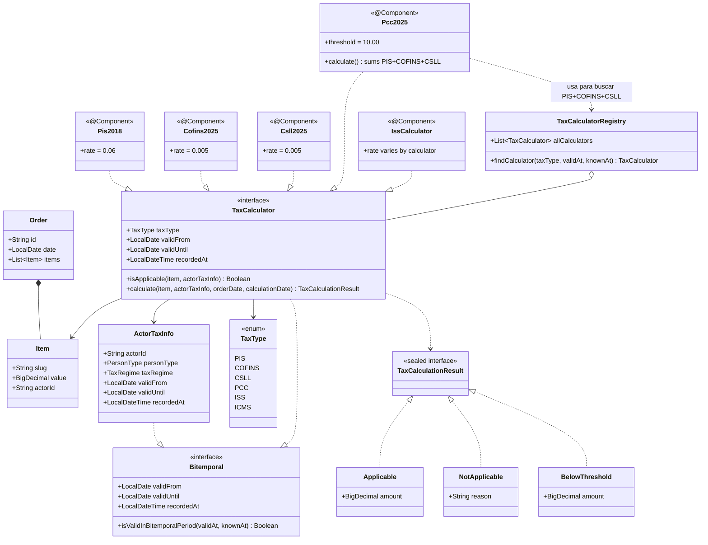
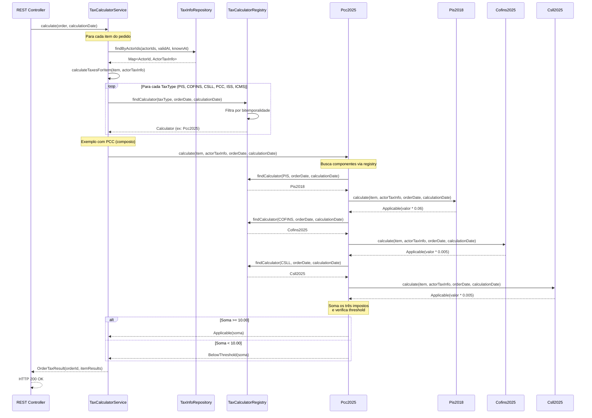

# Tax Calculation System

Sistema de cálculo de impostos com suporte a bitemporalidade, seguindo princípios de Domain-Driven Design (DDD).

## Arquitetura

O projeto segue uma arquitetura inspirada em DDD com Spring:

```
├── core/
│   ├── order/          # Domínio de pedidos (Order, Item)
│   └── tax/            # Domínio de impostos
│       ├── ActorTaxInfo.kt
│       ├── TaxCalculatorRegistry.kt
│       └── calculator/ # Implementações de calculadoras (PIS, COFINS, ISS, PCC, etc)
└── containers/
    └── api/            # Spring Boot application (TaxApi.kt)
```

### Diagrama de Classes



## Conceitos Principais

### Bitemporalidade

O sistema usa **duas dimensões de tempo** independentes:

1. **Valid Time** (`validFrom`/`validUntil`): Quando a informação é válida no mundo real
2. **Transaction Time** (`recordedAt`): Quando o sistema registrou essa informação

**Propósito**: Permite calcular impostos usando regras conhecidas em uma data (`calculationDate`) mas válidas para outra data (`order.date`). Essencial para:
- Recalcular pedidos antigos com conhecimento novo (leis retroativas)
- Auditoria temporal (reproduzir cálculos históricos)
- Rastreabilidade regulatória

#### Exemplo

```kotlin
// Pedido de março/2024, calculado em novembro/2024
val order = Order(
    id = "order-123",
    date = LocalDate.of(2024, 3, 15),
    items = listOf(...)
)

val result = taxCalculator.calculate(
    order = order,
    calculationDate = LocalDateTime.now() // novembro/2024
)

// Sistema busca calculadoras:
// - Válidas em março/2024 (validFrom <= 2024-03-15)
// - Registradas antes de novembro (recordedAt <= now)
// - Retorna a mais recente (maior recordedAt)
```

#### Implementação

O `TaxCalculatorRegistry` filtra calculadoras por período bitemporal:

```kotlin
fun findCalculator(
    taxType: TaxType,
    validAt: LocalDate,         // data do pedido
    knownAt: LocalDateTime      // data do cálculo
): TaxCalculator? {
    return calculatorsByType[taxType]
        ?.filter { it.isValidInBitemporalPeriod(validAt, knownAt) }
        ?.maxByOrNull { it.recordedAt }
}
```

### Impostos Implementados

- **PIS**: Taxa 0.06 (Pis2018)
- **COFINS**: Taxa 0.005 (Cofins2025)
- **CSLL**: Taxa 0.005 (Csll2025)
- **PCC**: Soma de PIS+COFINS+CSLL com threshold de 10.00 (Pcc2025)
- **ISS**: Serviços (Simples Nacional)
- **ICMS**: Mercadorias

### Diagrama de Sequência: Cálculo de Imposto PCC

Exemplo de como o sistema calcula o imposto PCC (composto) para um pedido:



**Pontos-chave do fluxo**:
1. **API REST Controller** (hipotético) recebe requisição e chama o service
2. **TaxCalculatorService** busca informações fiscais dos atores no repositório (com bitemporalidade)
3. Para cada item, itera por todos os tipos de imposto (PIS, COFINS, CSLL, PCC, ISS, ICMS)
4. **Registry** filtra calculadoras válidas no período bitemporal (`validAt` e `knownAt`) e retorna a com `recordedAt` mais recente
5. **PCC** usa `@Lazy` injection do registry para evitar dependência circular
6. PCC busca dinamicamente as versões corretas de PIS, COFINS e CSLL
7. Cada componente calcula seu imposto individualmente
8. PCC soma os resultados e aplica lógica de threshold
9. Service retorna `OrderTaxResult` com todos os impostos calculados por item

### Como Adicionar Nova Calculadora

1. Crie classe anotada com `@Component`
2. Implemente interface `TaxCalculator`
3. Defina campos bitemporais (`validFrom`, `validUntil`, `recordedAt`)

```kotlin
@Component
class Iss2026 : TaxCalculator {
    override val taxType = TaxType.ISS
    override val rate = 0.07
    override val validFrom = LocalDate.of(2026, 1, 1)
    override val validUntil = null
    override val recordedAt = LocalDateTime.of(2025, 11, 1, 10, 0)

    override fun isApplicable(item: Item, actorTaxInfo: ActorTaxInfo) =
        actorTaxInfo.taxRegime == TaxRegime.SIMPLES_NACIONAL

    override fun calculate(...) = Applicable(item.value * rate)
}
```

Spring automaticamente registra no `TaxCalculatorRegistry`.

## Build & Testes

```bash
# Build
./gradlew build

# Testes
./gradlew test
```

## Tecnologias

- Kotlin 1.9.20
- Spring Boot 3.2.0
- JUnit 5
- Gradle
